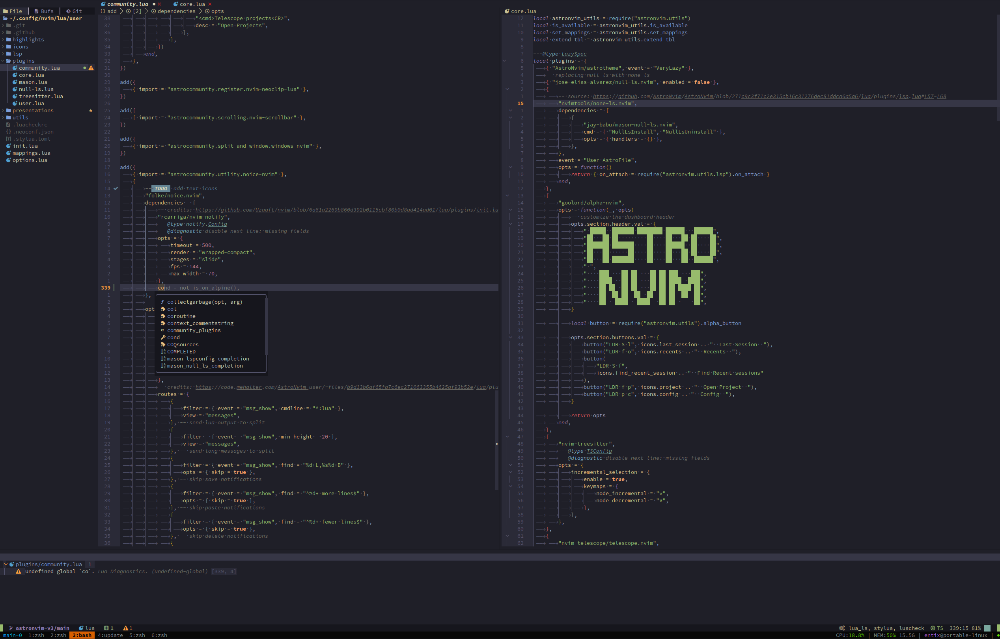

# AstroNvim

> This config is deprecated, use the [AstroNvim v4](https://github.com/manuuurino/nvim-config/tree/astronvim-v4/main) instead.

My [AstroNvim](https://github.com/AstroNvim/AstroNvim) configuration based on
the user configuration template.

## Preview




<!-- TODO: requirements
## Requirements
- cargo
- node
- lua
- deno
...

### Archlinux

```shell
sudo pacman -S
``` -->

## 🛠️ Installation

### Make a backup of your current nvim and shared folder

```shell
mv "${XDG_CONFIG_HOME:-${HOME}/.config}/nvim" "${XDG_CONFIG_HOME:-${HOME}/.config}/nvim.backup"
mv "${XDG_DATA_HOME:-${HOME}/.local/share}/nvim" "${XDG_DATA_HOME:-${HOME}/.local/share}/nvim.backup"
```

### Clone AstroNvim

```shell
git clone https://github.com/AstroNvim/AstroNvim "${XDG_CONFIG_HOME:-${HOME}/.config}/nvim"
```

### Clone my configuration

```shell
git clone --branch astronvim-v3/main https://github.com/manuuurino/nvim-config "${XDG_CONFIG_HOME:-${HOME}/.config}/nvim/lua/user"
```

### Installing spells

> the spells are already included in the repository

```shell
mkdir -p "${XDG_CONFIG_HOME:-${HOME}/.config}/nvim/spell"
wget -P "${XDG_CONFIG_HOME:-${HOME}/.config}/nvim/spell" \
  https://ftp.nluug.nl/pub/vim/runtime/spell/en.utf-8.spl \
  https://ftp.nluug.nl/pub/vim/runtime/spell/de.utf-8.spl
```

#### choose a mirror

https://www.vim.org/mirrors.php

### Try it in a docker container

> Some languages wont work, and it is expected, because they require some
> binaries. To keep it simpler, it installs a handfull only, you could add more
> if you like.

<!-- credits: https://github.com/AstroNvim/docs/blob/8646dd525c476fdb7429c310f4ff8018bf2f285f/src/content/docs/index.mdx#L106-L114 -->

```shell
docker run -w /root -it --rm alpine:edge sh -uelic '
  apk add bash git lua nodejs npm lazygit bottom python3 go neovim curl ripgrep alpine-sdk gzip cargo --update
  git clone --depth 1 https://github.com/AstroNvim/AstroNvim ~/.config/nvim
  git clone --branch astronvim-v3/main https://github.com/manuuurino/nvim-config ~/.config/nvim/lua/user
  mkdir -p "${XDG_CONFIG_HOME:-${HOME}/.config}/nvim/spell"
  wget -P "${XDG_CONFIG_HOME:-${HOME}/.config}/nvim/spell" \
    https://ftp.nluug.nl/pub/vim/runtime/spell/en.utf-8.spl \
    https://ftp.nluug.nl/pub/vim/runtime/spell/de.utf-8.spl
  nvim && bash
'
```
