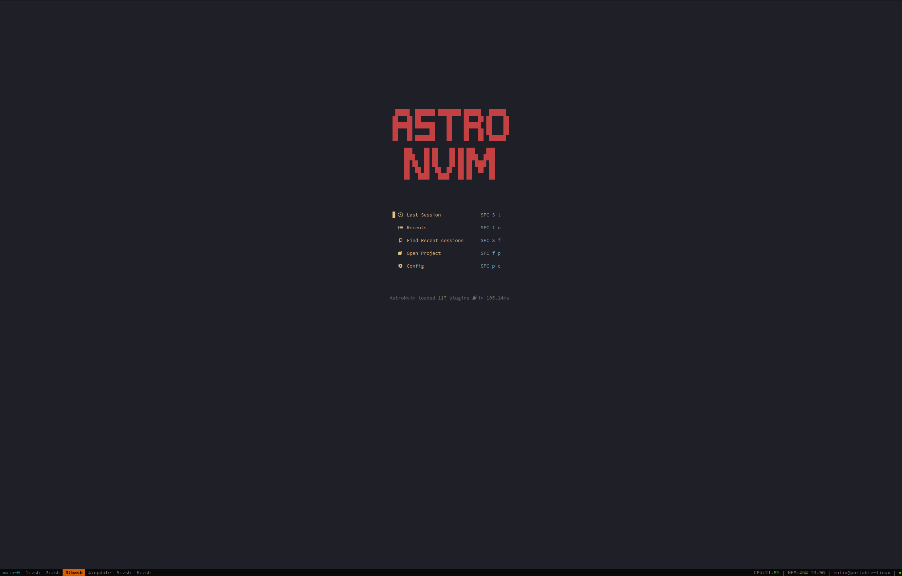
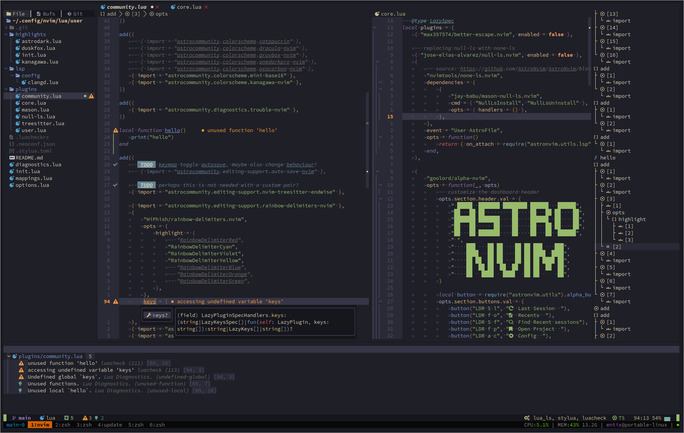

# AstroNvim
**NOTE:** This is for AstroNvim v4+

My [AstroNvim](https://github.com/AstroNvim/AstroNvim) configuration based on
the [user configuration template](https://github.com/AstroNvim/template).

## Preview

<!-- TODO: add images
  -->

<!-- TODO: requirements
## Requirements
- cargo
- node
- lua
- deno
...

### Archlinux

```shell
sudo pacman -S
``` -->

## 🛠️ Installation

### Make a backup of your current astronvim-v4 configuration and shared folder

```shell
mv "${XDG_CONFIG_HOME:-${HOME}/.config}/astronvim_v4" "${XDG_CONFIG_HOME:-${HOME}/.config}/astronvim_v4.backup"
mv "${XDG_DATA_HOME:-${HOME}/.local/share}/astronvim_v4" "${XDG_DATA_HOME:-${HOME}/.local/share}/astronvim_v4.backup"
```

### Clone my configuration

```shell
git clone --branch astronvim-v4/main https://github.com/manuuurino/nvim-config "${XDG_CONFIG_HOME:-${HOME}/.config}/astronvim_v4"
```

### Installing spells

> the spells are already included in the repository

```shell
mkdir -p "${XDG_CONFIG_HOME:-${HOME}/.config}/astronvim_v4/spell"
wget -P "${XDG_CONFIG_HOME:-${HOME}/.config}/astronvim_v4/spell" \
  https://ftp.nluug.nl/pub/vim/runtime/spell/en.utf-8.spl \
  https://ftp.nluug.nl/pub/vim/runtime/spell/de.utf-8.spl
```

#### choose a mirror

https://www.vim.org/mirrors.php

### Try it in a docker container

> Not all lsp, formatters and linters are supported in the docker container.

<!-- credits: https://github.com/AstroNvim/docs/blob/8646dd525c476fdb7429c310f4ff8018bf2f285f/src/content/docs/index.mdx#L106-L114 -->

```shell
docker run -w /root -it --rm alpine:edge sh -uelic '
  apk add bash git lua nodejs npm lazygit bottom python3 go neovim curl ripgrep alpine-sdk gzip cargo --update
  git clone --branch astronvim-v4/main https://github.com/manuuurino/nvim-config ~/.config/nvim/
  nvim && bash
'
```

## Start Neovim

```shell
NVIM_APPNAME=astronvim_v4 nvim
```

